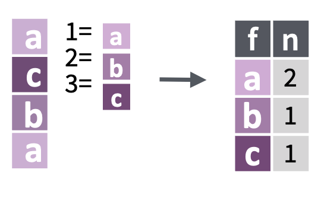
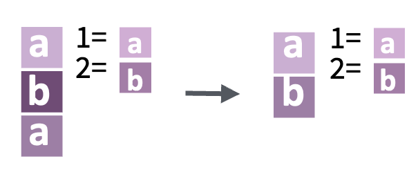
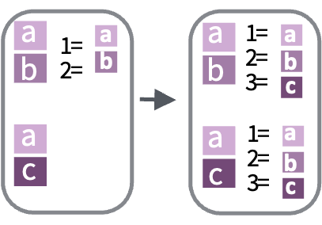
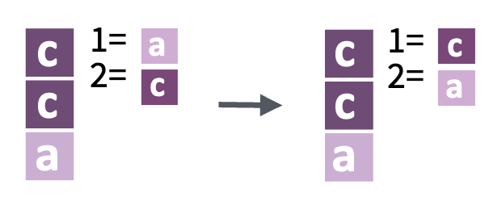
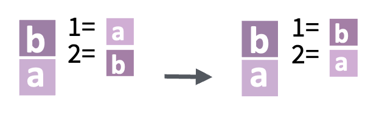
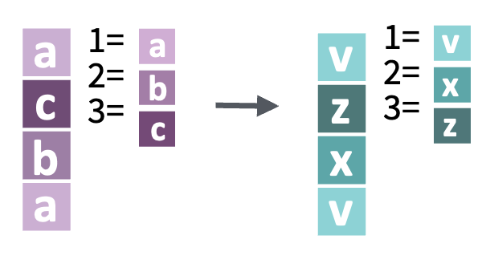
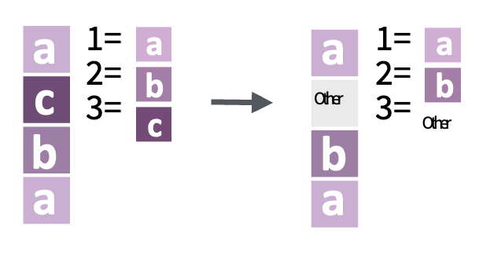
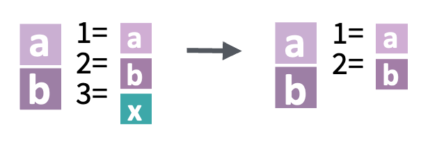
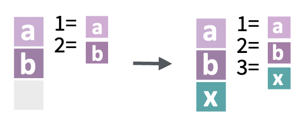

```{r setup, include=FALSE}
options(htmltools.dir.version = FALSE)
library(tidyverse)
```

```{r xaringan-themer, include=FALSE, warning=FALSE}
library(xaringanthemer)
style_mono_accent(
  base_color = "#1c5253",
  header_font_google = google_font("Josefin Sans"),
  text_font_google   = google_font("Montserrat", "300", "300i"),
  code_font_google   = google_font("Fira Mono")
)
```

```{css, echo=FALSE}
/*.columns { display: flex; }*/

.pull-left {
  padding-top: 0px;
}

.pull-left-narrow {
  float: left;
  width: 15%;
  padding-bottom: 5px
}

.pull-right-wide {
  float: right;
  width: 85%;
  padding-top: 0;
  padding-bottom: 5px/* Set to 0 or any value you feel looks right */
}

.column {
  float: left;
  width: 20%;
  padding: 5px;
}

.forcats-overview .column {
  float: left;
  width: 19%;
  padding: 1% 1%;
  box-sizing: border-box;  /* to ensure padding is included in width */
}
```
---
class: inverse, center, middle

# Get Started
---

# Introduction to Factors

Factors in R are utilized for **categorical variables** - variables with a known set of possible values. They:
1. Represent character vectors in non-alphabetical order.
2. Historically simplified working with characters.
3. Are helpful in tidyverse, avoiding automatic character-to-factor conversions.

> "In R, factors are used to work with categorical variables, variables that have a fixed and known set of possible values." - Source

### Where could data scientists collide with factors?
#### Surveys and Questionnaires:

- Questions with **multiple-choice** answers (e.g., "How satisfied are you with our service?" with responses: "Very Satisfied", "Satisfied", "Neutral", "Dissatisfied", "Very Dissatisfied").
- **Demographic data** like gender (e.g., "Male", "Female", "Other", "Prefer not to say").
---

# Creating and Working with Factors

**Issues with String Variables**:
- Limited valid values (e.g., months)
- Doesn't prevent typos or sort usefully.

**Solution** - Use Factors!

```r
# Example of creating a factor:
x1 <- c("Dec", "Apr", "Jan", "Mar")
month_levels <- c("Jan", "Feb", "Mar", "Apr", "May", "Jun", "Jul", "Aug", "Sep", "Oct", "Nov", "Dec")
y1 <- factor(x1, levels = month_levels)
```

**Benefits**:
1. Values not in the set become `NA`.
2. Sorts meaningfully.
3. Can set order of levels based on appearance in data using `fct_inorder()`.

> "To create a factor you must start by creating a list of the valid levels." - Source

---

class: .forcats-overview
# Overview of `forcats` Functions

1. **Inspect Factors**
   - `fct_count()`
   - `fct_unique()`

2. **Combine Factors**
   - `fct_c(...)`

3. **Change the Order of Levels**
   - `fct_relevel()`
   - `fct_infreq()`
   - `fct_reorder()`

4. **Change the Value of Levels**
   - `fct_recode()`
   - `fct_lump_min()`
   - `fct_other()`

5. **Add or Drop Levels**
   - `fct_drop()`
   - `fct_na_value_to_level()`

---
# Overview of `forcats` Functions

.pull-left[
1. **Inspect Factors**
   - `fct_count()`
   - `fct_unique()`

2. **Combine Factors**
   - `fct_c(...)`

3. **Change the Order of Levels**
   - `fct_relevel()`
   - `fct_infreq()`
   - `fct_reorder()`
]
.pull-right[
4. **Change the Value of Levels**
   - `fct_recode()`
   - `fct_lump_min()`
   - `fct_other()`

5. **Add or Drop Levels**
   - `fct_drop()`
   - `fct_na_value_to_level()`
]
---

# Inspect Factors

.pull-left-narrow[
  
]
.pull-right-wide[
`fct_count(f, sort = FALSE, prop = FALSE)`  
Count the number of values with each level.
]
<div style="clear:both;"></div>

**Example**:
```{r}
f <- factor(c("apple", "banana", "apple", "cherry", "banana", "apple"))
fct_count(f)
```
---

# Inspect Factors

.pull-left-narrow[
  
]
.pull-right-wide[
`fct_count(f, sort = FALSE, prop = FALSE)`  
Count the number of values with each level.
]
<div style="clear:both;"></div>

**Example**:
```{r, results = 'hide'}
f <- factor(c("apple", "banana", "apple", "cherry", "banana", "apple"))
fct_count(f)
```

.pull-left-narrow[

]
.pull-right-wide[
`fct_unique(f)` 
<br>
Return the unique values, removing duplicates.
]
<div style="clear:both;"></div>

**Example**:
```{r}
fct_unique(f)
```
---
# Combine Factors

.pull-left-narrow[
  
]
.pull-right-wide[
`fct_c(...)`  
Combine factors with different levels.
]
<div style="clear:both;"></div>

**Example**:
```{r}
f1 <- factor(c("a", "c"))
f2 <- factor(c("b", "a"))
fct_c(f1, f2)
```
---
# Combine Factors

.pull-left-narrow[
  
]
.pull-right-wide[
`fct_c(...)`  
Combine factors with different levels.
]
<div style="clear:both;"></div>

**Example**:
```{r, results = 'hide'}
fct_c(f1, f2)
```

.pull-left-narrow[

]
.pull-right-wide[
`fct_unify(fs, levels = lvls_union(fs))`
<br>
Standardize levels across a list of factors.
]

<div style="clear:both;"></div>
**Example**:
```{r}
fct_unify(list(f2, f1))
```
---

# Change the Order of Levels

.pull-left-narrow[
  
]
.pull-right-wide[
`fct_infreq(f, ordered = NA)` 
<br>
Reorder levels by the frequency in which they appear in the data (highest frequency first).
]
<div style="clear:both;"></div>

**Example**:
```{r}
fct_infreq(f)
```

---

# Change the Order of Levels

.pull-left-narrow[
  
]
.pull-right-wide[
`fct_infreq(f, ordered = NA)` 
<br>
Reorder levels by the frequency in which they appear in the data (highest frequency first).
]
<div style="clear:both;"></div>

**Example**:
```{r, results = 'hide'}
fct_infreq(f)
```

.pull-left-narrow[

]
.pull-right-wide[
`fct_inorder(f, ordered = NA)`
<br>
Reorder levels by the order in which they appear in the data.
]
<div style="clear:both;"></div>

**Example**:
```{r}
fct_inorder(f)
```
---

# Change the Value of Levels

.pull-left-narrow[
  
]
.pull-right-wide[
`fct_recode(f, ...)`  
Manually change levels.
]
<div style="clear:both;"></div>

**Example**:
```{r}
f <- factor(c("apple", "banana", "apple", "cherry"))
fct_recode(f, cherry = "apple")
```
---

# Change the Value of Levels

.pull-left-narrow[
  
]
.pull-right-wide[
`fct_recode(f, ...)`  
Manually change levels.
]
<div style="clear:both;"></div>

**Example**:
```{r, results = 'hide'}
fct_recode(f, cherry = "apple")
```

.pull-left-narrow[
  
]
.pull-right-wide[
`fct_other(f, keep, other = "(Other)")`  
Replace all levels not in `keep` with the value of `other`.
]
<div style="clear:both;"></div>

**Example**:
```{r }
fct_other(f, keep = c("apple", "banana"))
```
---
# Add or Drop Levels

.pull-left-narrow[
  
]
.pull-right-wide[
`fct_drop(f)`  
Drop unused levels from a factor.
]
<div style="clear:both;"></div>

**Example**:
```{r}
colors <- factor(c("Red", "Blue", "Green"), 
                 levels = c("Red", "Blue", "Green", "Yellow"))
# Yellow is an unused level
fct_drop(colors)
```
---
# Add or Drop Levels

.pull-left-narrow[
  
]
.pull-right-wide[
`fct_drop(f)`  
Drop unused levels from a factor.
]
<div style="clear:both;"></div>

**Example**:
```{r, results = 'hide'}
fct_drop(colors)
```

.pull-left-narrow[

]
.pull-right-wide[
`fct_na_value_to_level(f, level = "(Missing)")`
<br>
Convert NA to a specified level in a factor.
]

<div style="clear:both;"></div>

<div style="clear:both;"></div>
**Example**:
```{r}
colors_with_na <- factor(c("Red", "Blue", NA, "Green"))
fct_na_value_to_level(colors_with_na)
```
---

# Overview (old)

R uses __factors__ to handle categorical variables, variables that have a fixed and known set of possible values. Factors are also helpful for reordering character vectors to improve display. The goal of the __forcats__ package is to provide a suite of tools that solve common problems with factors, including changing the order of levels or the values. Some examples include: 

* `fct_reorder()`: Reordering a factor by another variable.
* `fct_infreq()`: Reordering a factor by the frequency of values.
* `fct_relevel()`: Changing the order of a factor by hand.
* `fct_lump()`: Collapsing the least/most frequent values of a factor into "other".

---

# Functions of `fct_reorder()` (old)
.pull-left[
`fct_inorder()`
Orders the levels by the sequence in which they first appear in the data.

**Usage:** 
```r
fct_inorder(f, ordered = NA)
```
**Arguments:** 
- `f`: A factor.
- `ordered`: A logical determining the "ordered" status of the output factor. NA maintains the current status.
]
.pull-right[
`fct_infreq()`
Orders levels based on the number of observations per level, starting from the most frequent.

**Usage:** 
```r
fct_infreq(f, w = NULL, ordered = NA)
```
**Arguments:** 
- `f`: A factor.
- `w`: Optional numeric vector specifying weights for each value's frequency in `f`.
- `ordered`: As explained above.
]


---

# Application
For the rest of this chapter, we’re going to focus on `forcats::gss_cat`. It’s a sample of data from the General Social Survey, which is a long-running US survey conducted by the independent research organization NORC at the University of Chicago. The survey has thousands of questions, so in `gss_cat` I’ve selected a handful that will illustrate some common challenges you’ll encounter when working with factors.

```{r comment='#'}
library(tidyverse)
head(gss_cat)
# fct_count(gss_cat$relig)
# fct_count(fct_lump(gss_cat$relig))
```

---

# remark.js

You can see an introduction of remark.js from [its homepage](https://remarkjs.com). You should read the [remark.js Wiki](https://github.com/gnab/remark/wiki) at least once to know how to

- create a new slide (Markdown syntax<sup>*</sup> and slide properties);

- format a slide (e.g. text alignment);

- configure the slideshow;

- and use the presentation (keyboard shortcuts).

It is important to be familiar with remark.js before you can understand the options in **xaringan**.

.footnote[[*] It is different with Pandoc's Markdown! It is limited but should be enough for presentation purposes. Come on... You do not need a slide for the Table of Contents! Well, the Markdown support in remark.js [may be improved](https://github.com/gnab/remark/issues/142) in the future.]

---
background-image: url(`r xaringan:::karl`)
background-size: cover
class: center, bottom, inverse

# I was so happy to have discovered remark.js!

---
class: inverse, middle, center

# Using xaringan

---

# xaringan

Provides an R Markdown output format `xaringan::moon_reader` as a wrapper for remark.js, and you can use it in the YAML metadata, e.g.

```yaml
---
title: "A Cool Presentation"
output:
  xaringan::moon_reader:
    yolo: true
    nature:
      autoplay: 30000
---
```

See the help page `?xaringan::moon_reader` for all possible options that you can use.

---

# remark.js vs xaringan

Some differences between using remark.js (left) and using **xaringan** (right):

.pull-left[
1. Start with a boilerplate HTML file;

1. Plain Markdown;

1. Write JavaScript to autoplay slides;

1. Manually configure MathJax;

1. Highlight code with `*`;

1. Edit Markdown source and refresh browser to see updated slides;
]

.pull-right[
1. Start with an R Markdown document;

1. R Markdown (can embed R/other code chunks);

1. Provide an option `autoplay`;

1. MathJax just works;<sup>*</sup>

1. Highlight code with `{{}}`;

1. The RStudio addin "Infinite Moon Reader" automatically refreshes slides on changes;
]

.footnote[[*] Not really. See next page.]

---

# R Code

```{r comment='#'}
# a boring regression
fit = lm(dist ~ 1 + speed, data = cars)
coef(summary(fit))
dojutsu = c('地爆天星', '天照', '加具土命', '神威', '須佐能乎', '無限月読')
grep('天', dojutsu, value = TRUE)
```


---

# Tables

If you want to generate a table, make sure it is in the HTML format (instead of Markdown or other formats), e.g.,

```{r}
knitr::kable(head(iris), format = 'html')
```

---

# HTML Widgets

I have not thoroughly tested HTML widgets against **xaringan**. Some may work well, and some may not. It is a little tricky.

Similarly, the Shiny mode (`runtime: shiny`) does not work. I might get these issues fixed in the future, but these are not of high priority to me. I never turn my presentation into a Shiny app. When I need to demonstrate more complicated examples, I just launch them separately. It is convenient to share slides with other people when they are plain HTML/JS applications.

See the next page for two HTML widgets.

---

```{r out.width='100%', fig.height=6, eval=require('leaflet')}
library(leaflet)
leaflet() %>% addTiles() %>% setView(-93.65, 42.0285, zoom = 17)
```

---

```{r eval=require('DT'), tidy=FALSE}
DT::datatable(
  head(iris, 10),
  fillContainer = FALSE, options = list(pageLength = 8)
)
```

---

# Some Tips

- Do not forget to try the `yolo` option of `xaringan::moon_reader`.

    ```yaml
    output:
      xaringan::moon_reader:
        yolo: true
    ```

---

# Some Tips

- Slides can be automatically played if you set the `autoplay` option under `nature`, e.g. go to the next slide every 30 seconds in a lightning talk:

    ```yaml
    output:
      xaringan::moon_reader:
        nature:
          autoplay: 30000
    ```

- If you want to restart the play after it reaches the last slide, you may set the sub-option `loop` to TRUE, e.g.,

    ```yaml
    output:
      xaringan::moon_reader:
        nature:
          autoplay:
            interval: 30000
            loop: true
    ```

---

# Some Tips

- A countdown timer can be added to every page of the slides using the `countdown` option under `nature`, e.g. if you want to spend one minute on every page when you give the talk, you can set:

    ```yaml
    output:
      xaringan::moon_reader:
        nature:
          countdown: 60000
    ```

    Then you will see a timer counting down from `01:00`, to `00:59`, `00:58`, ... When the time is out, the timer will continue but the time turns red.
    
---

# Some Tips

- The title slide is created automatically by **xaringan**, but it is just another remark.js slide added before your other slides.

    The title slide is set to `class: center, middle, inverse, title-slide` by default. You can change the classes applied to the title slide with the `titleSlideClass` option of `nature` (`title-slide` is always applied).

    ```yaml
    output:
      xaringan::moon_reader:
        nature:
          titleSlideClass: [top, left, inverse]
    ```
    
--

- If you'd like to create your own title slide, disable **xaringan**'s title slide with the `seal = FALSE` option of `moon_reader`.

    ```yaml
    output:
      xaringan::moon_reader:
        seal: false
    ```

---

# Some Tips

- There are several ways to build incremental slides. See [this presentation](https://slides.yihui.org/xaringan/incremental.html) for examples.

- The option `highlightLines: true` of `nature` will highlight code lines that start with `*`, or are wrapped in `{{ }}`, or have trailing comments `#<<`;

    ```yaml
    output:
      xaringan::moon_reader:
        nature:
          highlightLines: true
    ```

    See examples on the next page.

---

# Some Tips


.pull-left[
An example using a leading `*`:

    ```r
    if (TRUE) {
    ** message("Very important!")
    }
    ```
Output:
```r
if (TRUE) {
* message("Very important!")
}
```

This is invalid R code, so it is a plain fenced code block that is not executed.
]

.pull-right[
An example using `{{}}`:

````
`r ''````{r tidy=FALSE}
if (TRUE) {
*{{ message("Very important!") }}
}
```
````
Output:
```{r tidy=FALSE}
if (TRUE) {
{{ message("Very important!") }}
}
```

It is valid R code so you can run it. Note that `{{}}` can wrap an R expression of multiple lines.
]

---

# Some Tips

An example of using the trailing comment `#<<` to highlight lines:

````markdown
`r ''````{r tidy=FALSE}
library(ggplot2)
ggplot(mtcars) + 
  aes(mpg, disp) + 
  geom_point() +   #<<
  geom_smooth()    #<<
```
````

Output:

```{r tidy=FALSE, eval=FALSE}
library(ggplot2)
ggplot(mtcars) + 
  aes(mpg, disp) + 
  geom_point() +   #<<
  geom_smooth()    #<<
```

---

# Some Tips

When you enable line-highlighting, you can also use the chunk option `highlight.output` to highlight specific lines of the text output from a code chunk. For example, `highlight.output = TRUE` means highlighting all lines, and `highlight.output = c(1, 3)` means highlighting the first and third line.

````md
`r ''````{r, highlight.output=c(1, 3)}
head(iris)
```
````

```{r, highlight.output=c(1, 3), echo=FALSE}
head(iris)
```

Question: what does `highlight.output = c(TRUE, FALSE)` mean? (Hint: think about R's recycling of vectors)

---

# Some Tips

- To make slides work offline, you need to download a copy of remark.js in advance, because **xaringan** uses the online version by default (see the help page `?xaringan::moon_reader`).

- You can use `xaringan::summon_remark()` to download the latest or a specified version of remark.js. By default, it is downloaded to `libs/remark-latest.min.js`.

- Then change the `chakra` option in YAML to point to this file, e.g.

    ```yaml
    output:
      xaringan::moon_reader:
        chakra: libs/remark-latest.min.js
    ```

- If you used Google fonts in slides (the default theme uses _Yanone Kaffeesatz_, _Droid Serif_, and _Source Code Pro_), they won't work offline unless you download or install them locally. The Heroku app [google-webfonts-helper](https://google-webfonts-helper.herokuapp.com/fonts) can help you download fonts and generate the necessary CSS.

---

# Macros

- remark.js [allows users to define custom macros](https://github.com/yihui/xaringan/issues/80) (JS functions) that can be applied to Markdown text using the syntax `![:macroName arg1, arg2, ...]` or ``. For example, before remark.js initializes the slides, you can define a macro named `scale`:

    ```js
    remark.macros.scale = function (percentage) {
      var url = this;
      return '';
    };
    ```

    Then the Markdown text

    ```markdown
    
    ```

    will be translated to
    
    ```html
    
    ```

---

# Macros (continued)

- To insert macros in **xaringan** slides, you can use the option `beforeInit` under the option `nature`, e.g.,

    ```yaml
    output:
      xaringan::moon_reader:
        nature:
          beforeInit: "macros.js"
    ```

    You save your remark.js macros in the file `macros.js`.

- The `beforeInit` option can be used to insert arbitrary JS code before `remark.create()`. Inserting macros is just one of its possible applications.

---

# CSS

Among all options in `xaringan::moon_reader`, the most challenging but perhaps also the most rewarding one is `css`, because it allows you to customize the appearance of your slides using any CSS rules or hacks you know.

You can see the default CSS file [here](https://github.com/yihui/xaringan/blob/master/inst/rmarkdown/templates/xaringan/resources/default.css). You can completely replace it with your own CSS files, or define new rules to override the default. See the help page `?xaringan::moon_reader` for more information.

---

# CSS

For example, suppose you want to change the font for code from the default "Source Code Pro" to "Ubuntu Mono". You can create a CSS file named, say, `ubuntu-mono.css`:

```css
@import url(https://fonts.googleapis.com/css?family=Ubuntu+Mono:400,700,400italic);

.remark-code, .remark-inline-code { font-family: 'Ubuntu Mono'; }
```

Then set the `css` option in the YAML metadata:

```yaml
output:
  xaringan::moon_reader:
    css: ["default", "ubuntu-mono.css"]
```

Here I assume `ubuntu-mono.css` is under the same directory as your Rmd.

See [yihui/xaringan#83](https://github.com/yihui/xaringan/issues/83) for an example of using the [Fira Code](https://github.com/tonsky/FiraCode) font, which supports ligatures in program code.

---

# CSS (with Sass)

**xaringan** also supports Sass support via **rmarkdown**. Suppose you want to use the same color for different elements, e.g., first heading and bold text. You can create a `.scss` file, say `mytheme.scss`, using the [sass](https://sass-lang.com/) syntax with variables:

```scss
$mycolor: #ff0000; 
.remark-slide-content > h1 { color: $mycolor; }
.remark-slide-content strong { color: $mycolor; }
```

Then set the `css` option in the YAML metadata using this file placed under the same directory as your Rmd:

```yaml
output:
  xaringan::moon_reader:
    css: ["default", "mytheme.scss"]
```

This requires **rmarkdown** >= 2.8 and the [**sass**](https://rstudio.github.io/sass/) package. You can learn more about **rmarkdown** and **sass** support in [this blog post](https://blog.rstudio.com/2021/04/15/2021-spring-rmd-news/#sass-and-scss-support-for-html-based-output) and in [**sass** overview vignette](https://rstudio.github.io/sass/articles/sass.html).

---

# Themes

Don't want to learn CSS? Okay, you can use some user-contributed themes. A theme typically consists of two CSS files `foo.css` and `foo-fonts.css`, where `foo` is the theme name. Below are some existing themes:

```{r, R.options=list(width = 70)}
names(xaringan:::list_css())
```

---

# Themes

To use a theme, you can specify the `css` option as an array of CSS filenames (without the `.css` extensions), e.g.,

```yaml
output:
  xaringan::moon_reader:
    css: [default, metropolis, metropolis-fonts]
```

If you want to contribute a theme to **xaringan**, please read [this blog post](https://yihui.org/en/2017/10/xaringan-themes).

---
class: inverse, middle, center
background-image: url(https://upload.wikimedia.org/wikipedia/commons/3/39/Naruto_Shiki_Fujin.svg)
background-size: contain

# Naruto

---
background-image: url(https://upload.wikimedia.org/wikipedia/commons/b/be/Sharingan_triple.svg)
background-size: 100px
background-position: 90% 8%

# Sharingan

The R package name **xaringan** was derived<sup>1</sup> from **Sharingan**, a dōjutsu in the Japanese anime _Naruto_ with two abilities:

- the "Eye of Insight"

- the "Eye of Hypnotism"

I think a presentation is basically a way to communicate insights to the audience, and a great presentation may even "hypnotize" the audience.<sup>2,3</sup>

.footnote[
[1] In Chinese, the pronounciation of _X_ is _Sh_ /ʃ/ (as in _shrimp_). Now you should have a better idea of how to pronounce my last name _Xie_.

[2] By comparison, bad presentations only put the audience to sleep.

[3] Personally I find that setting background images for slides is a killer feature of remark.js. It is an effective way to bring visual impact into your presentations.
]

---

# Naruto terminology

The **xaringan** package borrowed a few terms from Naruto, such as

- [Sharingan](https://naruto.fandom.com/wiki/Sharingan) (写輪眼; the package name)

- The [moon reader](https://naruto.fandom.com/wiki/Moon_Reader) (月読; an attractive R Markdown output format)

- [Chakra](https://naruto.fandom.com/wiki/Chakra) (查克拉; the path to the remark.js library, which is the power to drive the presentation)

- [Nature transformation](https://naruto.fandom.com/wiki/Nature_Transformation) (性質変化; transform the chakra by setting different options)

- The [infinite moon reader](https://naruto.fandom.com/wiki/Infinite_Tsukuyomi) (無限月読; start a local web server to continuously serve your slides)

- The [summoning technique](https://naruto.fandom.com/wiki/Summoning_Technique) (download remark.js from the web)

You can click the links to know more about them if you want. The jutsu "Moon Reader" may seem a little evil, but that does not mean your slides are evil.

---

class: center

# Hand seals (印)

Press `h` or `?` to see the possible ninjutsu you can use in remark.js.


---

class: center, middle

# Thanks!

Slides created via the R package [**xaringan**](https://github.com/yihui/xaringan).

The chakra comes from [remark.js](https://remarkjs.com), [**knitr**](https://yihui.org/knitr/), and [R Markdown](https://rmarkdown.rstudio.com).
